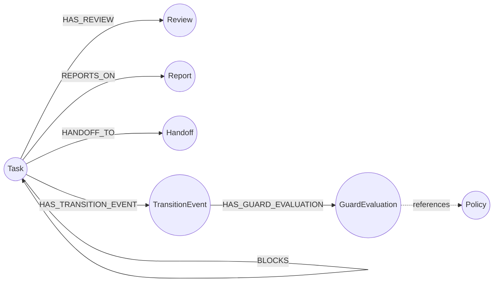

# Graph Data Model

Visual reference for Governor's Neo4j graph schema. All node types, relationships,
and key properties are shown below.

---

## Entity-Relationship Diagram



---

## Node Properties

### Task

| Property | Type | Description |
|----------|------|-------------|
| `task_id` | string | Unique identifier (indexed) |
| `task_name` | string | Human-readable name |
| `task_type` | string | INVESTIGATION, IMPLEMENTATION, DEPLOY, AUDIT |
| `role` | string | Assigned executor role |
| `status` | string | ACTIVE, READY_FOR_REVIEW, COMPLETED, REWORK, BLOCKED, FAILED |
| `priority` | string | CRITICAL, HIGH, MEDIUM, LOW |
| `content` | string | Task description / work product |
| `revision_count` | int | Number of rework cycles |
| `submitted_date` | datetime | When submitted for review |
| `completed_date` | datetime | When completed |
| `blocked_date` | datetime | When blocked |
| `failed_date` | datetime | When permanently failed |
| `blocking_reason` | string | Why the task is blocked (set by T05) |
| `failure_reason` | string | Why the task failed (set by T07/T08/T09) |
| `created_date` | datetime | Creation timestamp |
| `last_updated` | datetime | Last modification timestamp |

### Review

| Property | Type | Description |
|----------|------|-------------|
| `review_id` | string | Unique identifier |
| `review_type` | string | SELF_REVIEW, PEER_REVIEW, AUTOMATED |
| `reviewer_role` | string | Role of the reviewer |
| `rating` | float | Numeric quality score (0-10) |
| `content` | string | Review body text |
| `date` | datetime | Review timestamp |

### Report

| Property | Type | Description |
|----------|------|-------------|
| `report_id` | string | Unique identifier |
| `report_type` | string | INVESTIGATION, IMPLEMENTATION, DEPLOY, AUDIT, SUMMARY |
| `report_name` | string | Human-readable name |
| `content` | string | Report body (Markdown) |
| `report_date` | datetime | Report timestamp |

### Handoff

| Property | Type | Description |
|----------|------|-------------|
| `handoff_id` | string | Unique identifier |
| `from_role` | string | Sending role |
| `to_role` | string | Receiving role |
| `handoff_type` | string | TASK_ASSIGNMENT, REVIEW_COMPLETE, REWORK_REQUEST |
| `summary` | string | Brief handoff description |
| `created_date` | datetime | Handoff timestamp |

### Policy

| Property | Type | Description |
|----------|------|-------------|
| `policy_id` | string | Unique identifier |
| `policy_name` | string | Human-readable name |
| `policy_type` | string | SCORING_RUBRIC, GUARD_CONFIG, ROLE_MAPPING |
| `version` | string | Policy version |
| `status` | string | ACTIVE, DEPRECATED |
| `enforcement_level` | string | MANDATORY, ADVISORY |

### TransitionEvent

| Property | Type | Description |
|----------|------|-------------|
| `event_id` | string | Unique identifier |
| `transition_id` | string | T01-T09 identifier |
| `from_state` | string | Source state |
| `to_state` | string | Target state |
| `calling_role` | string | Role that triggered the transition |
| `result` | string | PASS or FAIL |
| `dry_run` | boolean | Whether this was a dry run |
| `timestamp` | datetime | When the transition occurred |
| `transition_params` | map | Additional parameters (blocking_reason, etc.) |

### GuardEvaluation

| Property | Type | Description |
|----------|------|-------------|
| `evaluation_id` | string | Unique identifier |
| `guard_id` | string | Guard identifier (EG-01, EG-02, etc.) |
| `passed` | boolean | Whether the guard passed |
| `reason` | string | Human-readable explanation |
| `fix_hint` | string | Actionable fix suggestion |
| `warning` | boolean | Advisory warning (non-blocking) |
| `timestamp` | datetime | Evaluation timestamp |

---

## Relationships

| Relationship | From | To | Description |
|-------------|------|----|-------------|
| `HAS_REVIEW` | Task | Review | Task has an associated review |
| `REPORTS_ON` | Task | Report | Task has an associated report |
| `HANDOFF_TO` | Task | Handoff | Task was handed off |
| `HAS_TRANSITION_EVENT` | Task | TransitionEvent | Transition attempt on this task |
| `HAS_GUARD_EVALUATION` | TransitionEvent | GuardEvaluation | Guard result for this transition |
| `DEPENDS_ON` | Task | Task | Task depends on another task |
| `BLOCKS` | Task | Task | Task blocks another task |

---

## Index Strategy

```cypher
-- Primary lookups
CREATE INDEX task_id_idx IF NOT EXISTS FOR (t:Task) ON (t.task_id);
CREATE INDEX review_id_idx IF NOT EXISTS FOR (r:Review) ON (r.review_id);
CREATE INDEX report_id_idx IF NOT EXISTS FOR (r:Report) ON (r.report_id);
CREATE INDEX event_id_idx IF NOT EXISTS FOR (e:TransitionEvent) ON (e.event_id);

-- Composite indexes for filtered queries
CREATE INDEX task_status_role IF NOT EXISTS FOR (t:Task) ON (t.status, t.role);
CREATE INDEX task_status_priority IF NOT EXISTS FOR (t:Task) ON (t.status, t.priority);
CREATE INDEX task_status_type IF NOT EXISTS FOR (t:Task) ON (t.status, t.task_type);
```
